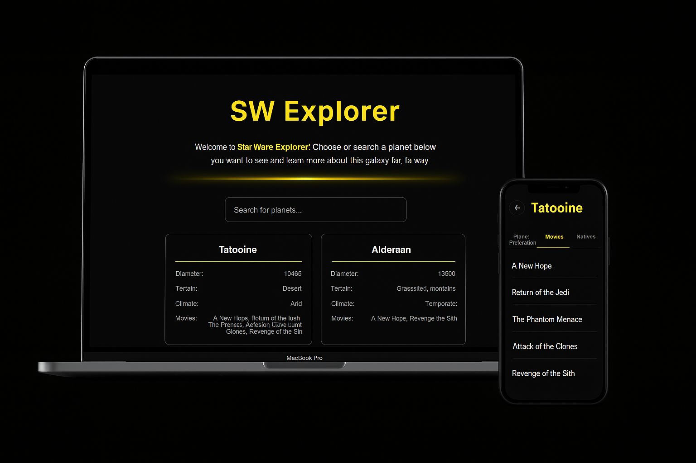

<p align="center">
  <a href="#-site">Site</a>&nbsp;&nbsp;&nbsp;|&nbsp;&nbsp;&nbsp;
  <a href="#-technology">Technology</a>&nbsp;&nbsp;&nbsp;|&nbsp;&nbsp;&nbsp;
  <a href="#-how-to-run">How to run</a>&nbsp;&nbsp;&nbsp;|&nbsp;&nbsp;&nbsp;
  <a href="#-project">Project</a>&nbsp;&nbsp;&nbsp;|&nbsp;&nbsp;&nbsp;
</p>

<br>

<p align="center">
  
</p>

## 🌌 Site

In the link below you will find the complete responsive website.

-   [Star Wars Api Project](https://star-wars-explorer-virid.vercel.app/)

## 🚀 Technology

This project was developed with the following technologies:

-   [Next.js](https://nextjs.org/)
-   [Typescript](https://www.typescriptlang.org/)
-   [Zustand](https://zustand-demo.pmnd.rs/)
-   [SASS](https://sass-lang.com/)
-   [Jest](https://jestjs.io/)
-   [Cypress](https://www.cypress.io/)
-   [SWAPI](https://swapi.py4e.com/)

## ⚙️ How to run

To run this project locally, follow the steps below:

```bash
# Install dependencies
npm install

# Run the development server
npm run dev
```

## 💻 Project

This is a dev challenge from ilia.digital.